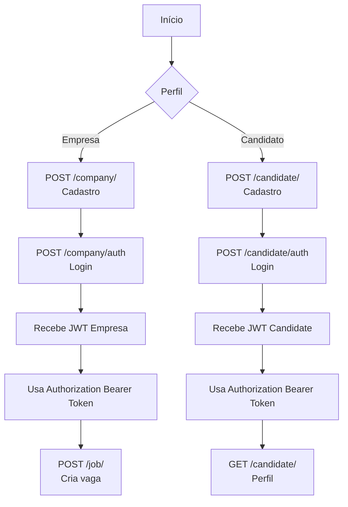

# Documentação da API - Gestão de Vagas

## 1) Visão geral

Esta API possui dois perfis principais:
- `company` (empresa)
- `candidate` (candidato)

Além disso, existe cadastro de vagas (`job`).

Base URL local:
- `http://localhost:8080`

---

## 2) Configuração necessária

Arquivo: `src/main/resources/application.properties`

```properties
spring.datasource.url=jdbc:postgresql://localhost:5432/gestao_vagas
spring.datasource.username=postgres
spring.datasource.password=postgres
spring.jpa.hibernate.ddl-auto=update

security.token.secret = @GESTAO_VAGAS_SECRET@123#
security.token.secret.candidate = @GESTAO_VAGAS_SECRET_CANDIDATE@123#
```

Pré-requisitos:
- PostgreSQL ativo
- banco `gestao_vagas` já criado
- aplicação Spring Boot rodando

---

## 3) Estratégia de autenticação

A API usa JWT com dois segredos:
- Token de empresa: `security.token.secret`
- Token de candidato: `security.token.secret.candidate`

Header esperado nas rotas protegidas:

```http
Authorization: Bearer <token>
```

### Geração de token
- Empresa: `POST /company/auth`
- Candidato: `POST /candidate/auth`

---

## 4) Rotas existentes

## 4.1 Empresa

### 4.1.1 Cadastrar empresa
- Método: `POST`
- Rota: `/company/`
- Autenticação: **não exige token**

Body (JSON):

```json
{
  "username": "empresa01",
  "email": "contato@empresa.com",
  "password": "123456",
  "website": "https://empresa.com",
  "name": "Empresa X",
  "description": "Empresa de tecnologia"
}
```

Comportamento:
- valida duplicidade por `username` ou `email`
- criptografa senha com `BCrypt`
- salva empresa

Resposta:
- `200 OK` com entidade criada
- `400 Bad Request` em caso de erro

---

### 4.1.2 Autenticar empresa
- Método: `POST`
- Rota: `/company/auth`
- Autenticação: **não exige token**

Body (JSON):

```json
{
  "username": "empresa01",
  "password": "123456"
}
```

Resposta:
- `200 OK` com `token` (string JWT)
- `401 Unauthorized` se usuário/senha inválidos

---

## 4.2 Candidato

### 4.2.1 Cadastrar candidato
- Método: `POST`
- Rota: `/candidate/`
- Autenticação: **não exige token**

Body (JSON):

```json
{
  "name": "João Silva",
  "username": "joaosilva",
  "email": "joao@email.com",
  "password": "123456",
  "description": "Desenvolvedor Java",
  "curriculum": "Spring Boot, PostgreSQL"
}
```

Comportamento:
- valida duplicidade por `username` ou `email`
- criptografa senha com `BCrypt`
- salva candidato

Resposta:
- `200 OK` com entidade criada
- `400 Bad Request` em caso de erro

---

### 4.2.2 Autenticar candidato
- Método: `RequestMapping` (na prática, use `POST`)
- Rota: `/candidate/auth`
- Autenticação: **não exige token**

Body (JSON):

```json
{
  "username": "joaosilva",
  "password": "123456"
}
```

Resposta:
- `200 OK` com:

```json
{
  "access_token": "<jwt>",
  "expires_in": 1714080000000
}
```

- `401 Unauthorized` se usuário/senha inválidos

Observação:
- token do candidato expira em ~2 minutos (conforme regra atual no use case)

---

### 4.2.3 Buscar perfil do candidato
- Método: `GET`
- Rota: `/candidate/`
- Autenticação: enviar token de candidato no header

Header:

```http
Authorization: Bearer <token-candidate>
```

Comportamento:
- filtro lê token e injeta `candidate_id` na request
- endpoint retorna perfil por ID

Resposta:
- `200 OK` com perfil
- `400 Bad Request` em caso de erro

---

## 4.3 Vaga

### 4.3.1 Criar vaga
- Método: `POST`
- Rota: `/job/`
- Autenticação esperada: token de empresa

Body (JSON):

```json
{
  "description": "Vaga Java Spring",
  "benefits": "VR, Plano de Saúde",
  "level": "Pleno"
}
```

Comportamento esperado:
- usa `company_id` da request para associar vaga à empresa
- salva vaga

Resposta:
- `200 OK` com vaga criada

---

## 5) Como utilizar (passo a passo)

### Fluxo empresa
1. `POST /company/` para cadastrar
2. `POST /company/auth` para obter JWT
3. enviar JWT em `Authorization: Bearer <token>` para rotas da empresa

### Fluxo candidato
1. `POST /candidate/` para cadastrar
2. `POST /candidate/auth` para obter JWT
3. usar token no `GET /candidate/` para consultar perfil

---

## 6) Exemplos com cURL

### 6.1 Cadastro empresa

```bash
curl -X POST http://localhost:8080/company/ \
  -H "Content-Type: application/json" \
  -d '{
    "username":"empresa01",
    "email":"contato@empresa.com",
    "password":"123456",
    "website":"https://empresa.com",
    "name":"Empresa X",
    "description":"Empresa de tecnologia"
  }'
```

### 6.2 Login empresa

```bash
curl -X POST http://localhost:8080/company/auth \
  -H "Content-Type: application/json" \
  -d '{"username":"empresa01","password":"123456"}'
```

### 6.3 Cadastro candidato

```bash
curl -X POST http://localhost:8080/candidate/ \
  -H "Content-Type: application/json" \
  -d '{
    "name":"João Silva",
    "username":"joaosilva",
    "email":"joao@email.com",
    "password":"123456",
    "description":"Dev Java",
    "curriculum":"Spring Boot"
  }'
```

### 6.4 Login candidato

```bash
curl -X POST http://localhost:8080/candidate/auth \
  -H "Content-Type: application/json" \
  -d '{"username":"joaosilva","password":"123456"}'
```

### 6.5 Perfil candidato autenticado

```bash
curl -X GET http://localhost:8080/candidate/ \
  -H "Authorization: Bearer <TOKEN_CANDIDATE>"
```

---

## 7) Observações técnicas importantes (estado atual)

1. Em `SecurityConfig`, os `requestMatchers` públicos estão com barra final:
   - `/company/`, `/candidate/`, `/company/auth/`, `/candidate/auth/`
   
   Dependendo da estratégia de matching, chamar sem barra final pode afetar autorização.

2. `AuthCandidateController` usa `@RequestMapping("/auth")` sem método HTTP explícito.
   - Recomenda-se `@PostMapping("/auth")`.

3. A rota `/job/` depende de `company_id` na request.
   - Esse atributo é populado pelo filtro da empresa apenas quando a URL inicia com `/company`.
   - Para `/job`, pode faltar `company_id` se o filtro não for adaptado para esse caminho.

---

## 8) Fluxograma da API



---

## 9) Checklist rápido de testes

- [ ] Cadastrar empresa
- [ ] Login empresa (obter token)
- [ ] Cadastrar candidato
- [ ] Login candidato (obter token)
- [ ] Buscar perfil de candidato com token
- [ ] Criar vaga com contexto de empresa autenticada
